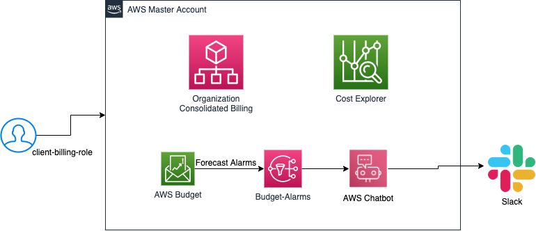

# terraform-aws-billing

This terraform module is a AWS Billing Module that add billing related aws resources.

The following resources will be created:

- IAM billing role
- AWS Budget
- SNS Budget Alarm

In addition you have the option to:

- Enable or not AWS Budget cost control
- Set The amount of cost or usage being measured for a budget
- Set The length of time until a budget resets the actual and forecasted spend. Valid values: MONTHLY, QUARTERLY, ANNUALLY.
- Set The unit of measurement used for the budget forecast, actual spend, or budget threshold, such as dollars or GB.
- E-Mail addresses to notify the budget
- Enable or not AWS Chatbot. If true, will create aws chatboot and integrate to slack
- Set Slack channel id to send budget notfication using AWS Chatbot
- Set Slack workspace id to send budget notfication using AWS Chatbot
- Set the Maximum CLI/API session duration

<!--- BEGIN_TF_DOCS --->

<!--- END_TF_DOCS --->

## Authors

Module managed by [DNX Solutions](https://github.com/DNXLabs).

## License

Apache 2 Licensed. See [LICENSE](https://github.com/DNXLabs/terraform-aws-billing/blob/master/LICENSE) for full details.